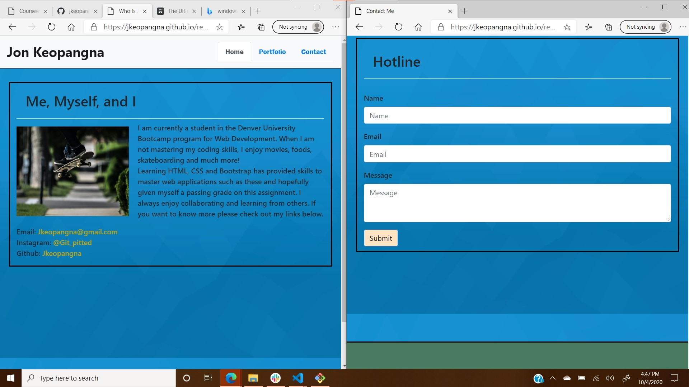

# BootcampHomework2

Responsive Portfolio

In this current environment of mobile accessibility, the demand for web applications responsive to mobile devices continues to grow. This assignment focuses on building a responsive portfolio application, sourcing and utilizing Bootstrap's layouts and grids. This assignment accomplishes the following by:

1. Providing functionality, consistency and validity of code
2. Utilizing Bootstrap's components and grid system
3. Including semantic HTML
4. Building a design responsive to multiple screen resolutions

The portfolio application can be previewed through the link and image provided.

[Responsive Portfolio](https://jkeopangna.github.io/responsivePortfolio/)

